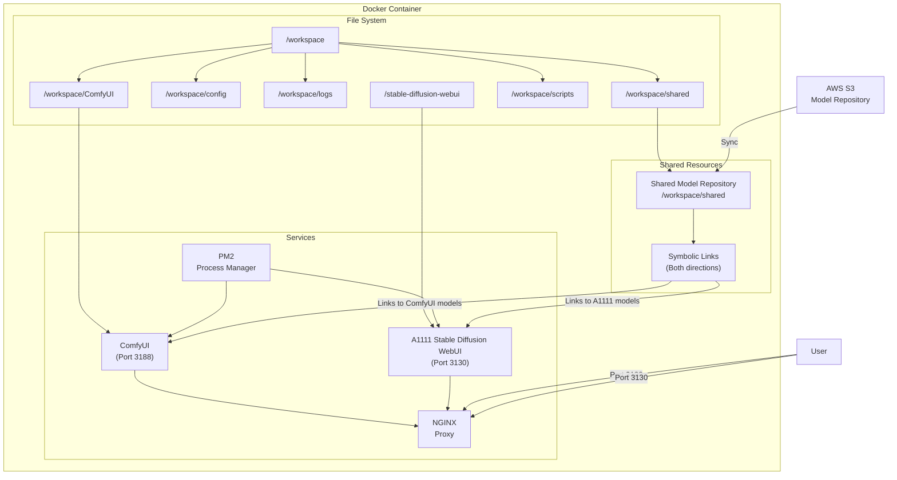
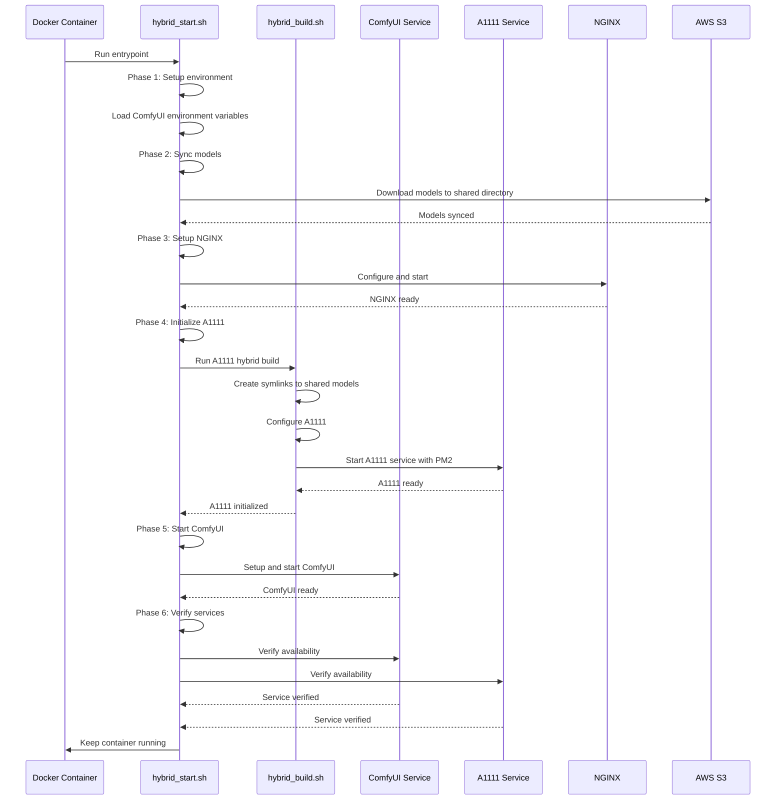
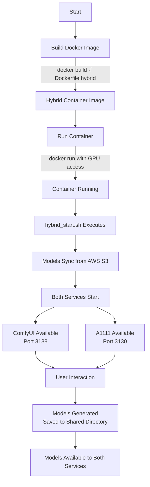
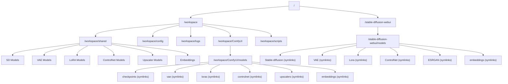

# Hybrid ComfyUI + A1111 Architecture Diagrams

## Container Architecture

```mermaid
graph TD
    subgraph "Docker Container"
        subgraph "File System"
            rootDir["/workspace"] --> comfyDir["/workspace/ComfyUI"]
            rootDir --> configDir["/workspace/config"]
            rootDir --> logsDir["/workspace/logs"]
            rootDir --> sharedDir["/workspace/shared"]
            rootDir --> scriptsDir["/workspace/scripts"]
            
            a1111Dir["/stable-diffusion-webui"]
        end
        
        subgraph "Services"
            comfyUI["ComfyUI\n(Port 3188)"]
            a1111["A1111 Stable Diffusion WebUI\n(Port 3130)"]
            nginx["NGINX\nProxy"]
            pm2["PM2\nProcess Manager"]
        end
        
        subgraph "Shared Resources"
            sharedModels["Shared Model Repository\n/workspace/shared"]
            symlinks["Symbolic Links\n(Both directions)"]
        end
        
        comfyDir --> comfyUI
        a1111Dir --> a1111
        
        comfyUI --> nginx
        a1111 --> nginx
        
        pm2 --> comfyUI
        pm2 --> a1111
        
        sharedDir --> sharedModels
        sharedModels --> symlinks
        symlinks -->|Links to ComfyUI models| comfyUI
        symlinks -->|Links to A1111 models| a1111
    end
    
    externalS3["AWS S3\nModel Repository"] -->|Sync| sharedModels
    
    user["User"] -->|Port 3188| nginx
    user -->|Port 3130| nginx
```

## Startup Process

```mermaid
sequenceDiagram
    participant Container as Docker Container
    participant HybridScript as hybrid_start.sh
    participant BuildScript as hybrid_build.sh
    participant ComfyUI as ComfyUI Service
    participant A1111 as A1111 Service
    participant NGINX as NGINX
    participant AWS as AWS S3
    
    Container->>HybridScript: Run entrypoint
    
    HybridScript->>HybridScript: Phase 1: Setup environment
    HybridScript->>HybridScript: Load ComfyUI environment variables
    
    HybridScript->>HybridScript: Phase 2: Sync models
    HybridScript->>AWS: Download models to shared directory
    AWS-->>HybridScript: Models synced
    
    HybridScript->>HybridScript: Phase 3: Setup NGINX
    HybridScript->>NGINX: Configure and start
    NGINX-->>HybridScript: NGINX ready
    
    HybridScript->>HybridScript: Phase 4: Initialize A1111
    HybridScript->>BuildScript: Run A1111 hybrid build
    BuildScript->>BuildScript: Create symlinks to shared models
    BuildScript->>BuildScript: Configure A1111
    BuildScript->>A1111: Start A1111 service with PM2
    A1111-->>BuildScript: A1111 ready
    BuildScript-->>HybridScript: A1111 initialized
    
    HybridScript->>HybridScript: Phase 5: Start ComfyUI
    HybridScript->>ComfyUI: Setup and start ComfyUI
    ComfyUI-->>HybridScript: ComfyUI ready
    
    HybridScript->>HybridScript: Phase 6: Verify services
    HybridScript->>ComfyUI: Verify availability
    HybridScript->>A1111: Verify availability
    ComfyUI-->>HybridScript: Service verified
    A1111-->>HybridScript: Service verified
    
    HybridScript->>Container: Keep container running
```

## Model Sharing and Symlinking

```mermaid
graph TD
    subgraph "Shared Model Repository"
        sharedDir["/workspace/shared"]
        sharedDir --> sdModels["SD Models"]
        sharedDir --> vaeModels["VAE Models"]
        sharedDir --> loraModels["LoRA Models"]
        sharedDir --> controlnetModels["ControlNet Models"]
        sharedDir --> upscalerModels["Upscaler Models"]
        sharedDir --> embeddings["Embeddings"]
    end
    
    subgraph "ComfyUI Models"
        comfyModels["/workspace/ComfyUI/models"]
        comfyModels --> comfySD["checkpoints"]
        comfyModels --> comfyVAE["vae"]
        comfyModels --> comfyLora["loras"]
        comfyModels --> comfyCN["controlnet"]
        comfyModels --> comfyUpscaler["upscalers"]
        comfyModels --> comfyEmbed["embeddings"]
    end
    
    subgraph "A1111 Models"
        a1111Models["/stable-diffusion-webui/models"]
        a1111Models --> a1111SD["Stable-diffusion"]
        a1111Models --> a1111VAE["VAE"]
        a1111Models --> a1111Lora["Lora"]
        a1111Models --> a1111CN["ControlNet"]
        a1111Models --> a1111ESRGAN["ESRGAN"]
        a1111Models --> a1111Embed["embeddings"]
    end
    
    sdModels -.->|Symlink| comfySD
    sdModels -.->|Symlink| a1111SD
    
    vaeModels -.->|Symlink| comfyVAE
    vaeModels -.->|Symlink| a1111VAE
    
    loraModels -.->|Symlink| comfyLora
    loraModels -.->|Symlink| a1111Lora
    
    controlnetModels -.->|Symlink| comfyCN
    controlnetModels -.->|Symlink| a1111CN
    
    upscalerModels -.->|Symlink| comfyUpscaler
    upscalerModels -.->|Symlink| a1111ESRGAN
    
    embeddings -.->|Symlink| comfyEmbed
    embeddings -.->|Symlink| a1111Embed
    
    awsS3["AWS S3 Model Repository"] -->|Sync| sharedDir
```

## Build and Run Process

```mermaid
flowchart TD
    A[Start] --> B[Build Docker Image]
    B -->|docker build -f Dockerfile.hybrid| C[Hybrid Container Image]
    C --> D[Run Container]
    D -->|docker run with GPU access| E[Container Running]
    
    E --> F[hybrid_start.sh Executes]
    F --> G[Models Sync from AWS S3]
    G --> H[Both Services Start]
    
    H --> I1[ComfyUI Available\nPort 3188]
    H --> I2[A1111 Available\nPort 3130]
    
    I1 --> J[User Interaction]
    I2 --> J
    
    J --> K[Models Generated\nSaved to Shared Directory]
    K --> L[Models Available to Both Services]
```

## Directory Structure

```mermaid
graph TD
    root["/"] --> workspace["/workspace"]
    root --> a1111Dir["/stable-diffusion-webui"]
    
    workspace --> comfyDir["/workspace/ComfyUI"]
    workspace --> configDir["/workspace/config"]
    workspace --> logsDir["/workspace/logs"]
    workspace --> sharedDir["/workspace/shared"]
    workspace --> scriptsDir["/workspace/scripts"]
    
    sharedDir --> sdModels["SD Models"]
    sharedDir --> vaeModels["VAE Models"]
    sharedDir --> loraModels["LoRA Models"]
    sharedDir --> controlnetModels["ControlNet Models"]
    sharedDir --> upscalerModels["Upscaler Models"]
    sharedDir --> embeddings["Embeddings"]
    
    comfyDir --> comfyModels["/workspace/ComfyUI/models"]
    comfyModels --> comfyCheckpoints["checkpoints (symlinks)"]
    comfyModels --> comfyVAE["vae (symlinks)"]
    comfyModels --> comfyLora["loras (symlinks)"]
    comfyModels --> comfyCN["controlnet (symlinks)"]
    comfyModels --> comfyUpscaler["upscalers (symlinks)"]
    comfyModels --> comfyEmbed["embeddings (symlinks)"]
    
    a1111Dir --> a1111Models["/stable-diffusion-webui/models"]
    a1111Models --> a1111SD["Stable-diffusion (symlinks)"]
    a1111Models --> a1111VAE["VAE (symlinks)"]
    a1111Models --> a1111Lora["Lora (symlinks)"]
    a1111Models --> a1111CN["ControlNet (symlinks)"]
    a1111Models --> a1111ESRGAN["ESRGAN (symlinks)"]
    a1111Models --> a1111Embed["embeddings (symlinks)"]
```
