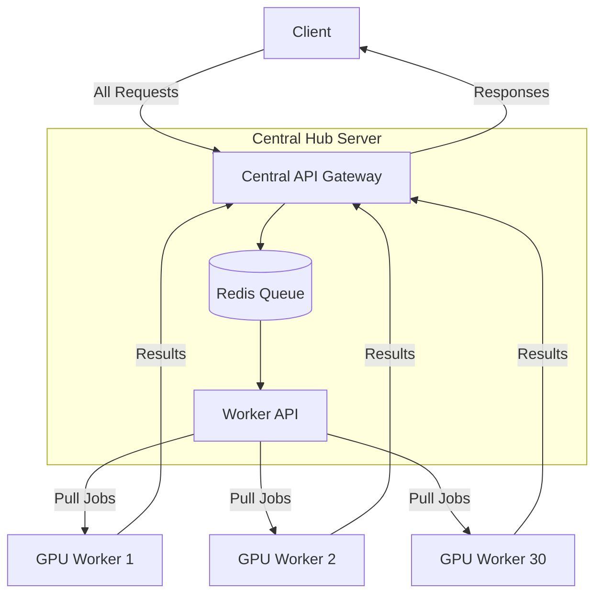

# Central Redis Queue System

This page describes how to implement a central Redis-based queue system for managing requests across multiple ComfyUI and A1111 instances running on separate machines.

## Overview

The central Redis queue system solves a critical issue in distributed AI inference setups: preventing "head-of-line blocking" where a long-running job on one machine can block other jobs when using simple load balancing.



## Architecture Benefits

1. **Eliminates Head-of-Line Blocking**
   - If one job takes a long time, other machines are unaffected
   - All GPU resources remain busy regardless of job duration

2. **Fair Request Distribution**
   - Workers pull jobs only when ready to process them
   - Equal work distribution regardless of job complexity  

3. **Centralized Management**
   - Single point for job submission and status tracking
   - Easy to monitor system load and performance

4. **Priority Support**
   - Can implement job priority levels
   - Critical jobs can jump ahead in the queue

## Implementation on AWS Hub

This implementation assumes you have:
- An AWS server acting as a hub with NGINX
- Multiple worker machines with ComfyUI/A1111 instances
- Network connectivity between all components

### 1. Hub Server Setup

#### Install Redis

```bash
# Install Redis
sudo apt-get update
sudo apt-get install -y redis-server

# Configure Redis for better performance
sudo sed -i 's/appendonly no/appendonly yes/' /etc/redis/redis.conf
sudo sed -i 's/# maxmemory-policy noeviction/maxmemory-policy volatile-lru/' /etc/redis/redis.conf

# Enable remote connections (if workers will connect directly to Redis)
# Only do this if Redis is protected by firewall and authentication
sudo sed -i 's/bind 127.0.0.1/bind 0.0.0.0/' /etc/redis/redis.conf

# Restart Redis
sudo systemctl restart redis-server
```

#### Create API Directory Structure

```bash
sudo mkdir -p /opt/queue-api/nginx-config
cd /opt/queue-api
```

#### Create Dependencies File

Create a `requirements.txt` file:

```
fastapi==0.68.0
uvicorn==0.15.0
redis==4.3.4
pydantic==1.8.2
requests==2.26.0
asyncio==3.4.3
```

#### Install Dependencies

```bash
sudo apt-get install -y python3-pip
pip3 install -r requirements.txt
```

### 2. Implement Queue API Service

Create a file named `app.py` with this content:

```python
from fastapi import FastAPI, HTTPException, BackgroundTasks
from pydantic import BaseModel
import redis
import json
import uuid
import time
import requests
from typing import Dict, Any, Optional, List

app = FastAPI(title="AI Queue API")
redis_client = redis.Redis(host='localhost', port=6379, db=0)

# Models
class JobRequest(BaseModel):
    workflow: Dict[str, Any]
    service: str = "comfyui"  # or "a1111"
    priority: int = 0

class JobStatus(BaseModel):
    id: str
    status: str
    created_at: float
    started_at: Optional[float] = None
    completed_at: Optional[float] = None
    position: Optional[int] = None
    result: Optional[Dict[str, Any]] = None
    error: Optional[str] = None

# Job queue management
@app.post("/submit", response_model=JobStatus)
async def submit_job(job_request: JobRequest):
    job_id = str(uuid.uuid4())
    timestamp = time.time()
    
    job_data = {
        "id": job_id,
        "status": "queued",
        "created_at": timestamp,
        "workflow": job_request.workflow,
        "service": job_request.service,
        "priority": job_request.priority
    }
    
    # Store job in Redis
    redis_client.set(f"job:{job_id}", json.dumps(job_data))
    
    # Add to queue (using priority if specified)
    if job_request.priority > 0:
        redis_client.zadd("priority_queue", {job_id: job_request.priority})
    else:
        redis_client.lpush("job_queue", job_id)
    
    # Calculate position in queue
    position = 0
    if job_request.priority > 0:
        position = redis_client.zcount("priority_queue", job_request.priority, float('inf'))
    else:
        position = redis_client.llen("job_queue")
    
    return JobStatus(
        id=job_id,
        status="queued",
        created_at=timestamp,
        position=position
    )

@app.get("/status/{job_id}", response_model=JobStatus)
async def get_job_status(job_id: str):
    job_data_json = redis_client.get(f"job:{job_id}")
    if not job_data_json:
        raise HTTPException(status_code=404, detail="Job not found")
    
    job_data = json.loads(job_data_json)
    
    # Calculate queue position if still queued
    position = None
    if job_data.get("status") == "queued":
        if job_data.get("priority", 0) > 0:
            position = redis_client.zcount("priority_queue", job_data["priority"], float('inf'))
        else:
            # Find position in regular queue
            queue = redis_client.lrange("job_queue", 0, -1)
            try:
                position = queue.index(job_id.encode()) + 1
            except ValueError:
                position = 0
    
    return JobStatus(
        id=job_data["id"],
        status=job_data["status"],
        created_at=job_data["created_at"],
        started_at=job_data.get("started_at"),
        completed_at=job_data.get("completed_at"),
        position=position,
        result=job_data.get("result"),
        error=job_data.get("error")
    )

# Worker API endpoints (for worker machines to pull jobs)
@app.get("/next-job")
async def get_next_job(worker_id: str, gpu_id: int, service: str = "comfyui"):
    """Endpoint for workers to pull the next job"""
    
    # First check priority queue
    next_job_id = None
    
    # Get highest priority job first
    priority_jobs = redis_client.zrevrange("priority_queue", 0, 0)
    if priority_jobs:
        next_job_id = priority_jobs[0].decode()
        redis_client.zrem("priority_queue", next_job_id)
    else:
        # Get from regular queue
        job = redis_client.rpop("job_queue")
        if job:
            next_job_id = job.decode()
    
    if not next_job_id:
        return {"status": "no_jobs"}
    
    # Get job data
    job_data_json = redis_client.get(f"job:{next_job_id}")
    if not job_data_json:
        return {"status": "error", "message": "Job data not found"}
    
    job_data = json.loads(job_data_json)
    
    # Update job status
    job_data["status"] = "processing"
    job_data["started_at"] = time.time()
    job_data["worker_id"] = worker_id
    job_data["gpu_id"] = gpu_id
    
    # Save updated job data
    redis_client.set(f"job:{next_job_id}", json.dumps(job_data))
    
    return job_data

@app.post("/complete-job/{job_id}")
async def complete_job(job_id: str, result: Dict[str, Any] = None, error: str = None):
    """Endpoint for workers to report job completion"""
    
    job_data_json = redis_client.get(f"job:{job_id}")
    if not job_data_json:
        raise HTTPException(status_code=404, detail="Job not found")
    
    job_data = json.loads(job_data_json)
    
    # Update job status
    job_data["status"] = "completed" if not error else "failed"
    job_data["completed_at"] = time.time()
    
    if result:
        job_data["result"] = result
    
    if error:
        job_data["error"] = error
    
    # Save updated job data
    redis_client.set(f"job:{job_id}", json.dumps(job_data))
    
    return {"status": "updated"}

# Queue statistics
@app.get("/stats")
async def get_queue_stats():
    """Get queue statistics"""
    queued = redis_client.llen("job_queue")
    priority = redis_client.zcard("priority_queue")
    
    # Count jobs by status
    processing = 0
    completed = 0
    failed = 0
    
    # This is inefficient but works for demo
    # In production, use Redis sets to track jobs by status
    keys = redis_client.keys("job:*")
    for key in keys:
        job_data = json.loads(redis_client.get(key))
        status = job_data.get("status")
        if status == "processing":
            processing += 1
        elif status == "completed":
            completed += 1
        elif status == "failed":
            failed += 1
    
    return {
        "queued": queued + priority,
        "priority_queue": priority,
        "standard_queue": queued,
        "processing": processing,
        "completed": completed,
        "failed": failed
    }

if __name__ == "__main__":
    import uvicorn
    uvicorn.run(app, host="0.0.0.0", port=8000)
```

### 3. Configure NGINX for the API

Create a file named `/opt/queue-api/nginx-config/queue-api.conf`:

```nginx
server {
    listen 80;
    server_name api.yourdomain.com;  # Adjust to your domain

    location / {
        proxy_pass http://localhost:8000;
        proxy_set_header Host $host;
        proxy_set_header X-Real-IP $remote_addr;
        proxy_set_header X-Forwarded-For $proxy_add_x_forwarded_for;
        proxy_set_header X-Forwarded-Proto $scheme;
        
        # Longer timeouts for AI processing
        proxy_connect_timeout 300s;
        proxy_send_timeout 300s;
        proxy_read_timeout 300s;
    }
}
```

Link to NGINX configuration:

```bash
sudo ln -s /opt/queue-api/nginx-config/queue-api.conf /etc/nginx/sites-available/
sudo ln -s /etc/nginx/sites-available/queue-api.conf /etc/nginx/sites-enabled/
sudo nginx -t  # Test configuration
sudo systemctl reload nginx
```

### 4. Create Systemd Service for Queue API

Create a file named `/etc/systemd/system/queue-api.service`:

```
[Unit]
Description=AI Queue API Service
After=network.target redis-server.service

[Service]
User=ubuntu  # Change to appropriate user
WorkingDirectory=/opt/queue-api
ExecStart=/usr/bin/python3 -m uvicorn app:app --host 0.0.0.0 --port 8000
Restart=always
StandardOutput=journal
StandardError=journal

[Install]
WantedBy=multi-user.target
```

Enable and start the service:

```bash
sudo systemctl enable queue-api
sudo systemctl start queue-api
```

## Worker Implementation

On each GPU worker machine, you need to implement a worker script that pulls jobs from the central queue. Here's how to do it:

### 1. Create Worker Script

Create a file named `worker.py` on each worker machine:

```python
import requests
import json
import time
import subprocess
import os
import sys
import socket
import logging

# Setup logging
logging.basicConfig(
    level=logging.INFO,
    format='%(asctime)s - %(name)s - %(levelname)s - %(message)s',
    handlers=[
        logging.FileHandler("/var/log/ai-worker.log"),
        logging.StreamHandler()
    ]
)
logger = logging.getLogger("ai-worker")

# Configuration
API_BASE_URL = "http://your-hub-server.com"  # Change to your hub server
WORKER_ID = socket.gethostname()  # Use hostname as worker ID
GPU_ID = int(os.environ.get("GPU_ID", 0))  # Can be set via environment variable
SERVICE_TYPE = os.environ.get("SERVICE_TYPE", "comfyui")  # comfyui or a1111
POLL_INTERVAL = 5  # seconds between polls when idle

# Service endpoint configuration
if SERVICE_TYPE == "comfyui":
    SERVICE_URL = f"http://localhost:{3188 + GPU_ID}"  # Assuming ComfyUI port pattern
else:  # a1111
    SERVICE_URL = f"http://localhost:{3130 + GPU_ID}"  # Assuming A1111 port pattern

def get_next_job():
    """Poll the queue API for the next job"""
    try:
        response = requests.get(
            f"{API_BASE_URL}/next-job",
            params={
                "worker_id": WORKER_ID,
                "gpu_id": GPU_ID,
                "service": SERVICE_TYPE
            }
        )
        return response.json()
    except Exception as e:
        logger.error(f"Error getting next job: {e}")
        return {"status": "error"}

def process_comfyui_job(job_data):
    """Process a ComfyUI job"""
    try:
        workflow = job_data.get("workflow", {})
        
        # Send to ComfyUI API
        response = requests.post(
            f"{SERVICE_URL}/api/queue",
            json=workflow
        )
        
        if response.status_code != 200:
            raise Exception(f"ComfyUI API returned {response.status_code}: {response.text}")
            
        # Get prompt ID from response
        result = response.json()
        prompt_id = result.get("prompt_id")
        
        # Wait for completion
        while True:
            status_resp = requests.get(f"{SERVICE_URL}/api/queue")
            queue_status = status_resp.json()
            
            # Check if our job is done
            if prompt_id not in queue_status.get("queue_running", {}) and \
               prompt_id not in queue_status.get("queue_pending", {}):
                # Job completed
                break
                
            time.sleep(2)
        
        # Get the final result (image URLs, etc)
        history_resp = requests.get(f"{SERVICE_URL}/api/history/{prompt_id}")
        history = history_resp.json()
        
        return {
            "status": "success",
            "prompt_id": prompt_id,
            "outputs": history.get("outputs", {})
        }
        
    except Exception as e:
        logger.error(f"Error processing ComfyUI job: {e}")
        return {"status": "error", "message": str(e)}

def process_a1111_job(job_data):
    """Process an A1111 job - implement similar to ComfyUI but with A1111 API"""
    # Implementation would be similar but adapted to A1111 API
    pass

def report_job_completion(job_id, result):
    """Report job completion back to the queue API"""
    try:
        response = requests.post(
            f"{API_BASE_URL}/complete-job/{job_id}",
            json={"result": result}
        )
        return response.json()
    except Exception as e:
        logger.error(f"Error reporting job completion: {e}")
        return {"status": "error"}

def report_job_failure(job_id, error_message):
    """Report job failure back to the queue API"""
    try:
        response = requests.post(
            f"{API_BASE_URL}/complete-job/{job_id}",
            json={"error": error_message}
        )
        return response.json()
    except Exception as e:
        logger.error(f"Error reporting job failure: {e}")
        return {"status": "error"}

def main_loop():
    """Main worker loop"""
    logger.info(f"Starting AI worker: {WORKER_ID} - GPU {GPU_ID} - Service {SERVICE_TYPE}")
    
    while True:
        # Get next job from queue
        job = get_next_job()
        
        if job.get("status") == "no_jobs":
            # No jobs available, wait and try again
            time.sleep(POLL_INTERVAL)
            continue
            
        if job.get("status") == "error":
            # Error getting job, wait and try again
            time.sleep(POLL_INTERVAL * 2)  # Wait longer on error
            continue
            
        # We have a job to process
        job_id = job.get("id")
        logger.info(f"Processing job {job_id}")
        
        try:
            # Process based on service type
            if SERVICE_TYPE == "comfyui":
                result = process_comfyui_job(job)
            else:  # a1111
                result = process_a1111_job(job)
                
            # Report completion
            if result.get("status") == "success":
                logger.info(f"Job {job_id} completed successfully")
                report_job_completion(job_id, result)
            else:
                logger.error(f"Job {job_id} failed: {result.get('message')}")
                report_job_failure(job_id, result.get("message", "Unknown error"))
                
        except Exception as e:
            logger.error(f"Unexpected error processing job {job_id}: {e}")
            report_job_failure(job_id, str(e))
            
        # Brief pause before next job
        time.sleep(1)

if __name__ == "__main__":
    try:
        main_loop()
    except KeyboardInterrupt:
        logger.info("Worker shutting down")
        sys.exit(0)
```

### 2. Create Systemd Service for Worker

Create a file named `/etc/systemd/system/ai-worker.service`:

```
[Unit]
Description=AI Worker Service
After=network.target

[Service]
User=ubuntu  # Change to appropriate user
Environment="GPU_ID=0"  # Set to appropriate GPU ID
Environment="SERVICE_TYPE=comfyui"  # or a1111
WorkingDirectory=/path/to/worker/directory
ExecStart=/usr/bin/python3 worker.py
Restart=always
StandardOutput=journal
StandardError=journal

[Install]
WantedBy=multi-user.target
```

Enable and start the service:

```bash
sudo systemctl enable ai-worker
sudo systemctl start ai-worker
```

## Usage Example

Once the system is set up, clients can submit jobs to the central API:

```python
import requests
import json

# Submit a ComfyUI workflow
workflow = {
    # Your ComfyUI workflow JSON here
}

response = requests.post(
    "http://your-hub-server.com/submit",
    json={
        "workflow": workflow,
        "service": "comfyui",
        "priority": 0
    }
)

job_data = response.json()
print(f"Job submitted with ID: {job_data['id']}")

# Check status
while True:
    status_response = requests.get(f"http://your-hub-server.com/status/{job_data['id']}")
    status = status_response.json()
    
    print(f"Status: {status['status']}")
    if status['status'] == "completed":
        print("Job completed!")
        print(f"Results: {status['result']}")
        break
    elif status['status'] == "failed":
        print(f"Job failed: {status['error']}")
        break
        
    time.sleep(5)  # Check every 5 seconds
```

## Conclusion

This central Redis queue architecture provides an effective solution for distributing AI inference tasks across multiple machines, each with multiple GPUs. The key benefits are:

1. **Fair job distribution** with no head-of-line blocking
2. **Maximum GPU utilization** since workers only pull jobs when ready
3. **Centralized monitoring** of all jobs across the entire system
4. **Priority queue support** for urgent jobs
5. **Scalability** - easily add or remove worker machines without reconfiguring
