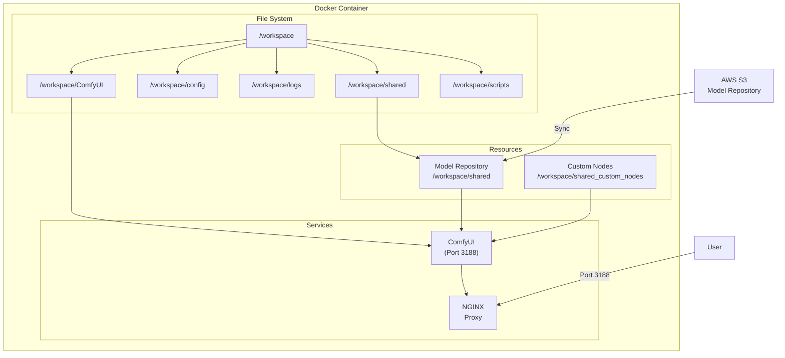
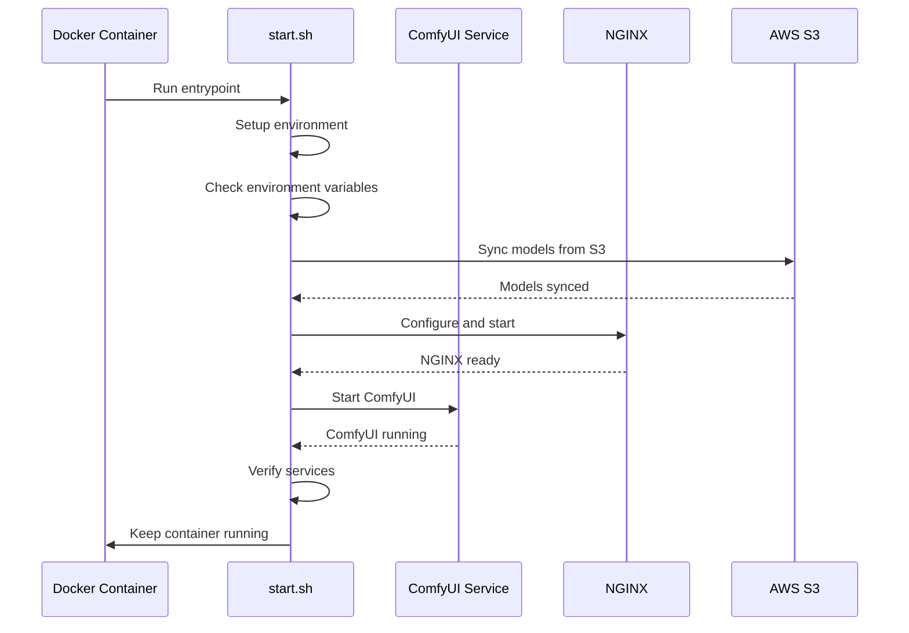

# ComfyUI Container

This page documents the standalone ComfyUI Docker container.

## Overview

The ComfyUI container provides a complete, self-contained environment for running ComfyUI with all necessary dependencies pre-installed.

## Architecture

## Container Components

- **PyTorch Base**: `pytorch/pytorch:2.1.2-cuda12.1-cudnn8-runtime`
- **ComfyUI**: Latest version from GitHub
- **NGINX**: For serving web interface
- **Model Management**: AWS S3 integration for model syncing

## Directory Structure

- `/workspace`: Root directory
  - `/workspace/ComfyUI`: ComfyUI installation
  - `/workspace/config`: Configuration files
  - `/workspace/logs`: Log files
  - `/workspace/shared`: Shared model repository
  - `/workspace/shared_custom_nodes`: Custom ComfyUI nodes

## Startup Process

## Key Scripts

- `start.sh`: Main entry point
- `s3_sync.sh`: AWS S3 model synchronization
- `setup_nginx.sh`: NGINX configuration

## Environment Variables

| Variable | Description | Required |
|----------|-------------|----------|
| `ROOT` | Root directory | No |
| `AWS_S3_BUCKET` | S3 bucket for models | Yes (for S3 sync) |
| `AWS_ACCESS_KEY_ID` | AWS access key | Yes (for S3 sync) |
| `AWS_SECRET_ACCESS_KEY` | AWS secret key | Yes (for S3 sync) |
| `AWS_DEFAULT_REGION` | AWS region | Yes (for S3 sync) |

For a complete list of environment variables, see the [Installation Guide](/docker/installation).

## Building and Running

See the [Installation Guide](/docker/installation) for detailed instructions on building and running the container.
