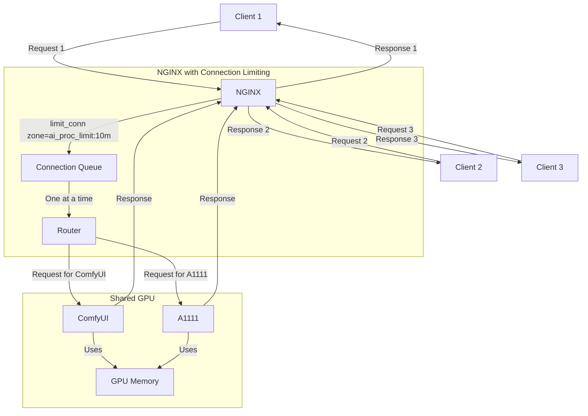
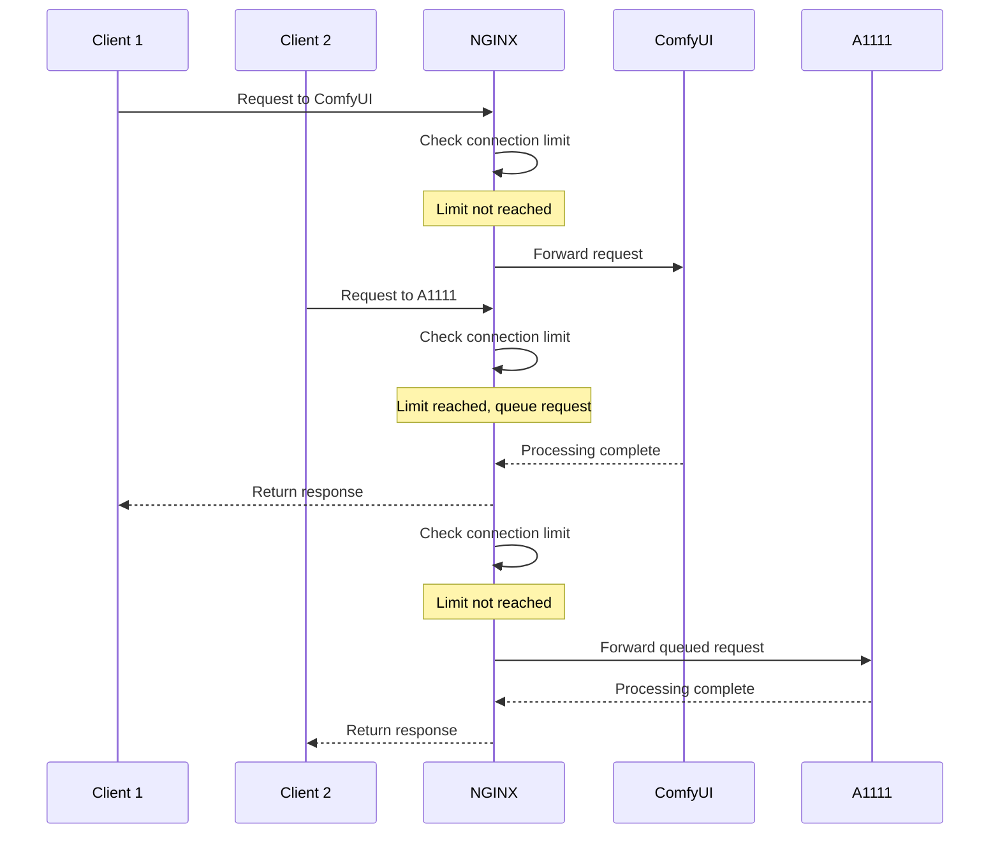
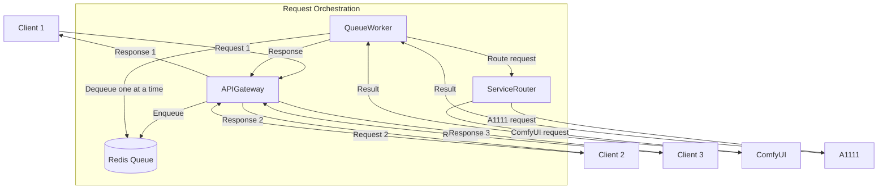
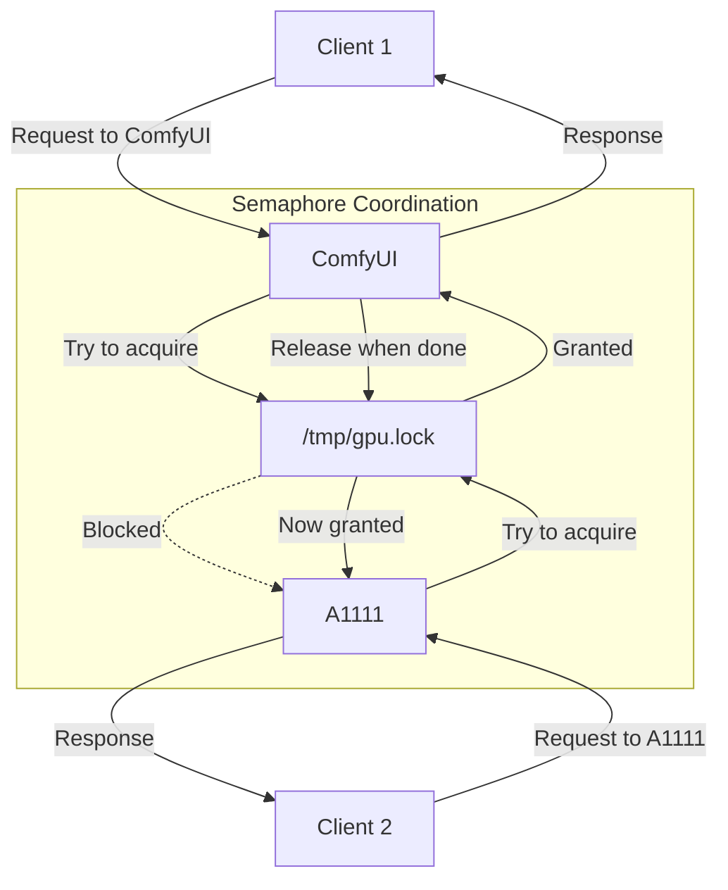
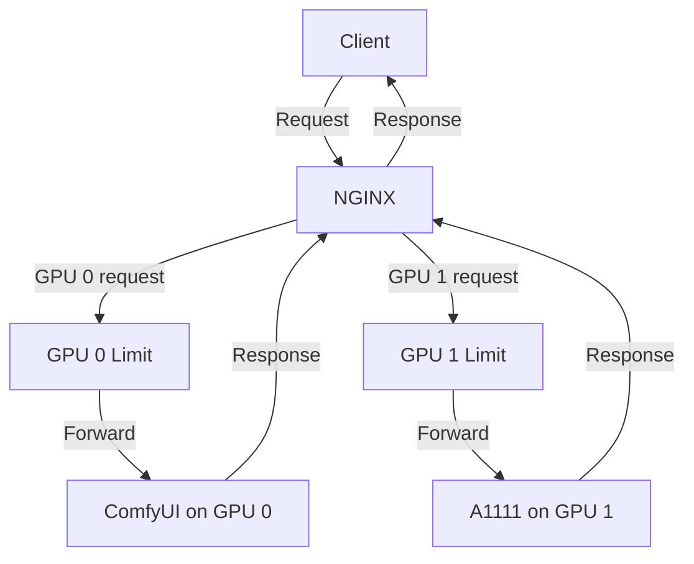
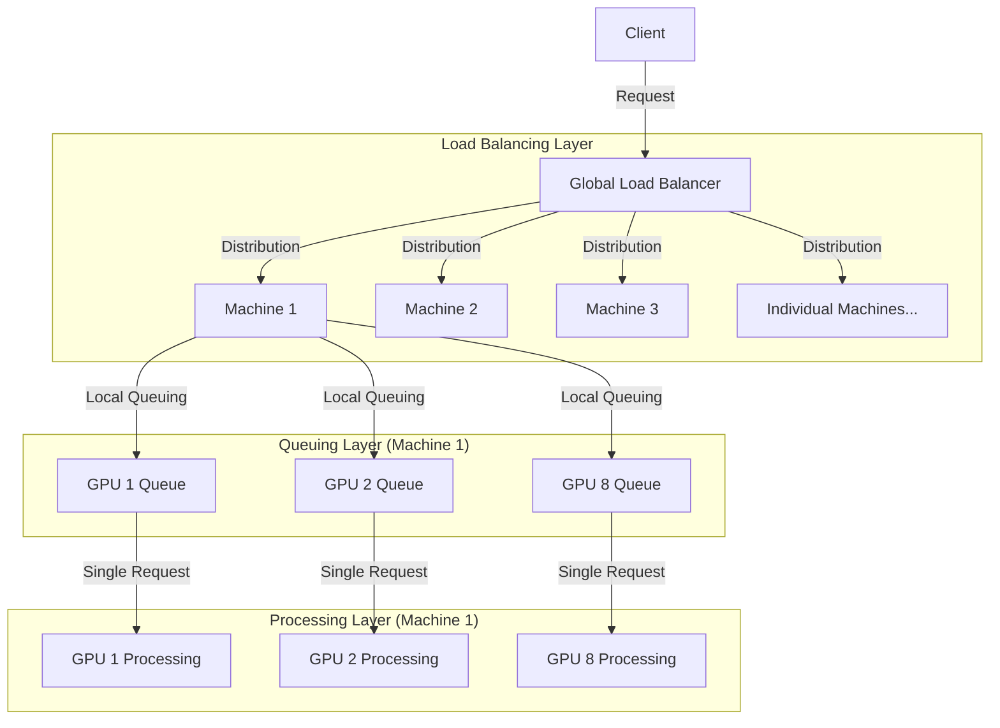
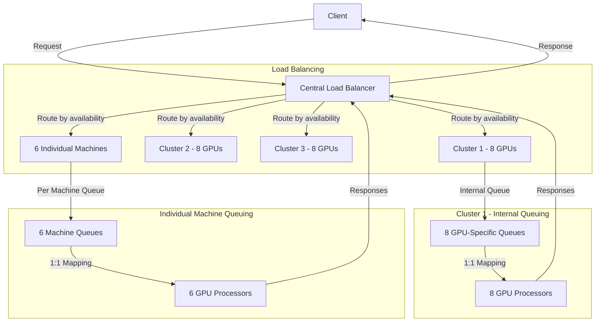
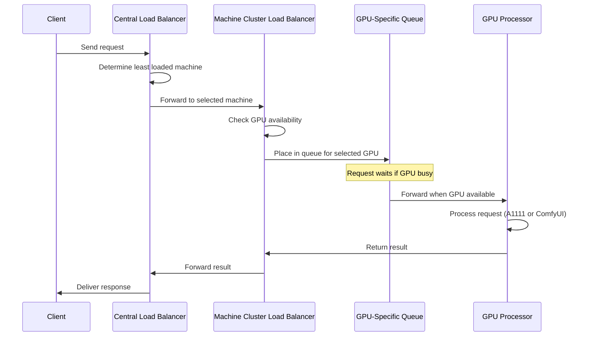

# AI Request Queue System

This page describes different approaches to orchestrating requests between ComfyUI and A1111 Stable Diffusion WebUI in the hybrid container setup, with a focus on preventing simultaneous GPU usage.

## Overview

When running both ComfyUI and A1111 on the same GPU, it's important to ensure that only one service processes a request at a time. This prevents GPU memory conflicts and ensures more stable operation.

## NGINX-Based Request Limiting (Recommended)

The simplest and most lightweight approach uses NGINX's built-in rate limiting and connection control features to manage request flow.



### Implementation

In your NGINX configuration:

```nginx
# Define a shared memory zone for limiting connections
limit_conn_zone $binary_remote_addr zone=ai_proc_limit:10m;

# Server block for AI services
server {
    listen 80;
    server_name example.com;
    
    # Apply connection limit
    limit_conn ai_proc_limit 1;  
    limit_conn_status 429;       # Return 429 when limit reached
    
    # Comfy location
    location /comfy/ {
        proxy_pass http://localhost:3188/;
        # other proxy settings...
    }
    
    # A1111 location
    location /sd/ {
        proxy_pass http://localhost:3130/;
        # other proxy settings...
    }
}
```

### Request Flow Sequence



## Alternative: Redis-Based Queue System

For more complex scenarios, a Redis-based queue system offers more control and visibility.



## Alternative: File-Based Semaphore

A simple file-based semaphore approach that requires minimal additional components.



## Comparison of Approaches

| Approach | Complexity | Dependencies | Maintenance | Scalability |
|----------|------------|--------------|------------|-------------|
| NGINX Connection Limiting | Low | None (using existing NGINX) | Minimal | Good |
| Redis Queue | Medium | Redis | Moderate | Excellent |
| File Semaphore | Low | None | Low | Limited |

## Implementation

To implement the recommended NGINX approach:

1. Update NGINX configuration to include connection limiting
2. Set appropriate timeout values
3. Restart NGINX to apply changes

### Optional Configuration

Adjust request timeout settings to accommodate longer-running jobs:

```nginx
# Longer timeouts for AI generation
proxy_read_timeout 300s;
proxy_connect_timeout 300s;
proxy_send_timeout 300s;
```

## Multi-GPU Considerations

When using multiple GPUs, you can either:

1. Apply connection limiting per GPU
2. Allow one request per GPU simultaneously



## Large-Scale Multi-Machine Architecture

For large deployments with multiple machines and many GPUs (e.g., 30 GPUs across several machines), a hierarchical architecture provides the best combination of performance and control.

### Queuing vs. Load Balancing

In a distributed architecture, we need to distinguish between:

- **Load Balancing**: Distributing requests across available resources
- **Request Queuing**: Ensuring requests don't exceed processing capacity

These happen at different levels in the architecture:



### Detailed Architecture for 30 GPUs

This architecture works for our specific scenario of 30 GPUs across multiple machines (3 machines with 8 GPUs each, plus 6 individual machines).



### Request Flow Sequence

Here's how requests flow through this system:



### Implementation Details

#### Central Load Balancer Configuration

```nginx
# Central Load Balancer NGINX config

# Define machine upstreams
upstream machine1_cluster {
    server machine1.example.com:80 weight=8;  # Weight by number of GPUs
}

upstream machine2_cluster {
    server machine2.example.com:80 weight=8;
}

upstream machine3_cluster {
    server machine3.example.com:80 weight=8;
}

upstream individual_machines {
    server individual1.example.com:80 weight=1;
    server individual2.example.com:80 weight=1;
    # ... and so on for all individual machines
}

# Combined upstream with all machines
upstream all_ai_services {
    server machine1.example.com:80 weight=8;
    server machine2.example.com:80 weight=8;
    server machine3.example.com:80 weight=8;
    server individual1.example.com:80 weight=1;
    # ... etc for all individual machines
}

server {
    listen 80;
    server_name ai-central.example.com;
    
    # Simple round-robin load balancing
    location / {
        proxy_pass http://all_ai_services;
        proxy_next_upstream error timeout http_502;
        # Additional proxy settings...
    }
}
```

#### Machine-Level Load Balancer Configuration

```nginx
# Machine-Level NGINX (e.g., on machine1 with 8 GPUs)

# Define per-GPU services
upstream gpu0_services {
    server 127.0.0.1:3188;  # ComfyUI on GPU 0
    server 127.0.0.1:3130;  # A1111 on GPU 0
}

upstream gpu1_services {
    server 127.0.0.1:3189;  # ComfyUI on GPU 1
    server 127.0.0.1:3131;  # A1111 on GPU 1
}

# ... repeat for all 8 GPUs

# Create connection limiting zones for each GPU
limit_conn_zone $binary_remote_addr zone=gpu0_limit:10m;
limit_conn_zone $binary_remote_addr zone=gpu1_limit:10m;
# ... repeat for all GPUs

server {
    listen 80;
    
    # GPU 0 services
    location /gpu0/ {
        limit_conn gpu0_limit 1;  # This is where queuing happens!
        proxy_pass http://gpu0_services;
    }
    
    # GPU 1 services
    location /gpu1/ {
        limit_conn gpu1_limit 1;  # Queue requests for GPU 1
        proxy_pass http://gpu1_services;
    }
    
    # ... repeat for all GPUs
}
```

### Key Benefits of This Architecture

1. **Separation of Concerns**:
   - Load balancing happens at the central level (distributing across machines)
   - Queuing happens at the machine level (managing GPU-specific request flow)

2. **Horizontal Scalability**:
   - Add new machines to the central load balancer without reconfiguring existing machines
   - Each machine manages its own GPU resources independently

3. **Fault Tolerance**:
   - If a machine fails, the central load balancer routes traffic to other machines
   - Each machine can operate independently even if the central load balancer is temporarily unavailable

4. **Resource Optimization**:
   - Requests are queued only at the GPU level, ensuring max utilization
   - Load balancing ensures even distribution across all available machines
