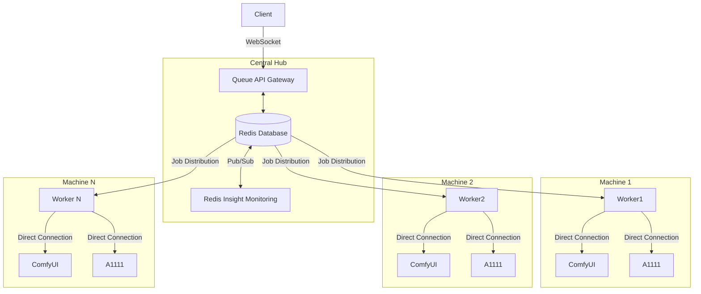

# Redis Queue Architecture for Distributed AI Processing

## Executive Summary

The Redis Queue Architecture provides a scalable, fault-tolerant system for distributing AI workloads across multiple machines and GPUs. It uses Redis as a central job coordinator, enabling intelligent job routing, prioritization, and real-time status tracking for ComfyUI and A1111 Stable Diffusion services.

## System Components



### 1. Client Interface
- Web or application interface for submitting jobs
- Maintains WebSocket connection for real-time updates
- Receives and displays job results

### 2. Queue API Gateway
- Handles client connections and authentication
- Manages WebSocket connections for real-time updates
- Publishes jobs to Redis queues
- Forwards status updates to clients

### 3. Redis Database
- Stores job data and metadata
- Maintains prioritized job queues
- Tracks worker status and health
- Facilitates pub/sub messaging for real-time updates

### 4. Redis Insight Monitoring
- Provides visualization of queue status
- Monitors worker performance and health
- Tracks job throughput and completion rates
- Enables system administration and debugging

### 5. Worker Processes
- Run on each GPU-enabled machine
- Pull jobs from Redis based on availability
- Communicate directly with AI services (ComfyUI, A1111)
- Report job status and results back to Redis

### 6. AI Services
- ComfyUI and A1111 Stable Diffusion instances
- Process actual AI inference workloads
- Report progress via WebSockets to workers

## Detailed Data Flow

### Job Submission Flow

1. **Client Initiates Connection**
   - Client establishes WebSocket connection to Queue API
   - Authentication and session establishment occurs

2. **Job Submission**
   - Client sends job payload via WebSocket message
   ```json
   {
     "type": "submit_job",
     "job_type": "comfy_workflow",
     "priority": 5,
     "payload": {
       "workflow_id": "example_workflow",
       "parameters": { ... }
     }
   }
   ```

3. **Job Registration**
   - Queue API generates unique job ID
   - Job details stored in Redis hash: `HSET job:{job_id} field value [field value ...]`
   ```
   HSET job:12345 
     job_type comfy_workflow 
     priority 5 
     status pending 
     created_at 1677849302 
     client_id client_xyz 
     payload "{...}"
   ```

4. **Queue Placement**
   - Job ID added to priority queue: `ZADD priority_queue {priority} job:{job_id}`
   - Higher priority = lower score = processed first

5. **Initial Response**
   - Queue API sends acknowledgment to client via WebSocket
   ```json
   {
     "type": "job_accepted",
     "job_id": "12345",
     "status": "pending",
     "position": 3,
     "estimated_start": "30s"
   }
   ```

### Job Processing Flow

1. **Worker Availability Registration**
   - Worker processes register availability with Redis
   ```
   HSET worker:{worker_id} 
     machine_id machine-1 
     gpu_id 0 
     status idle 
     last_heartbeat 1677849302
     start_time 1677800000
   ```

2. **Job Assignment**
   - Worker pulls highest priority job from queue
   ```
   -- Get next job
   ZPOPMIN priority_queue
   
   -- Mark job as assigned
   HSET job:12345 
     status processing 
     worker_id worker-xyz 
     started_at 1677849320
   ```

3. **Service Selection**
   - Worker determines appropriate service (ComfyUI/A1111)
   - Worker establishes WebSocket to selected service
   - Worker forwards job to service

4. **Progress Updates**
   - AI service sends progress updates via WebSocket
   - Worker publishes updates to Redis pub/sub
   ```
   PUBLISH job:12345:updates '{"progress": 45, "status": "processing"}'
   ```
   
5. **Client Notification**
   - Queue API subscribes to job update channels
   - Updates forwarded to client via WebSocket
   ```json
   {
     "type": "job_update",
     "job_id": "12345",
     "status": "processing",
     "progress": 45,
     "eta": "15s"
   }
   ```

### Job Completion Flow

1. **Result Collection**
   - AI service sends final results to worker
   - Worker processes and potentially transforms results
   - Results stored in Redis (or external storage for large data)
   ```
   HSET job:12345 
     status completed 
     completed_at 1677849420 
     result_type image 
     result_data "{base64_or_url}"
   ```

2. **Completion Notification**
   - Completion event published to Redis pub/sub
   ```
   PUBLISH job:12345:updates '{"status": "completed", "result_url": "..."}'
   ```

3. **Client Notification**
   - Queue API forwards completion notice to client
   ```json
   {
     "type": "job_completed",
     "job_id": "12345",
     "status": "completed",
     "result": { ... }
   }
   ```

4. **Worker Status Update**
   - Worker marks itself as available
   - Worker pulls next job from queue

## Redis Data Structures

### Job Data
- **Hash**: `job:{job_id}`
  - Fields: job_type, priority, status, client_id, created_at, started_at, completed_at, worker_id, payload, result_data

### Queues
- **Sorted Set**: `priority_queue`
  - Score: Priority value (lower = higher priority)
  - Member: Job ID reference

### Worker Status
- **Hash**: `worker:{worker_id}`
  - Fields: machine_id, gpu_id, status, last_heartbeat, start_time, current_job

### Real-time Updates
- **Pub/Sub Channels**:
  - `job:{job_id}:updates`: Job-specific updates
  - `workers:status`: Worker status changes
  - `system:alerts`: System-wide alerts

## Scalability and Fault Tolerance

### Horizontal Scaling
- Add more worker machines without changing architecture
- Workers auto-register with the central Redis instance
- No configuration changes needed for expansion

### Fault Recovery
- Workers send periodic heartbeats to Redis
- Dead worker detection via heartbeat monitoring
- Orphaned jobs automatically reassigned to available workers
- Job state preserved in Redis for recovery

### High Availability
- Redis persistence ensures job recovery after restarts
- Redis replication possible for database redundancy
- Worker reconnection logic handles temporary network issues

## Monitoring and Administration

Redis Insight provides real-time visibility into:
- Queue length and job distribution
- Worker status and utilization
- System throughput and performance
- Error rates and bottlenecks

## Security Considerations

- API gateway handles authentication and authorization
- Internal communications secured via network isolation
- Redis access controlled via authentication
- Worker validation prevents unauthorized job processing

## Deployment Configuration

The system runs in Docker containers for easy deployment and scaling:

```yaml
# Docker Compose configuration excerpt
services:
  redis:
    image: redis:latest
    ports:
      - "6379:6379"
    volumes:
      - redis-data:/data
      
  redis-insight:
    image: redislabs/redisinsight:latest
    ports:
      - "8001:8001"
    volumes:
      - redis-insight-data:/data
      
  queue-api:
    build: ./queue-api
    ports:
      - "8000:8000"
    environment:
      - REDIS_HOST=redis
      - REDIS_PORT=6379
      
  worker:
    build: ./worker
    environment:
      - REDIS_HOST=redis
      - REDIS_PORT=6379
      - MACHINE_ID=machine-1
      - GPU_COUNT=2
```
