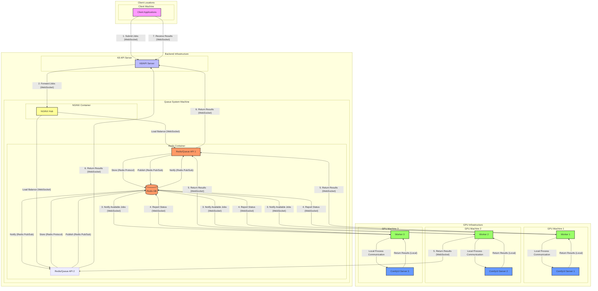
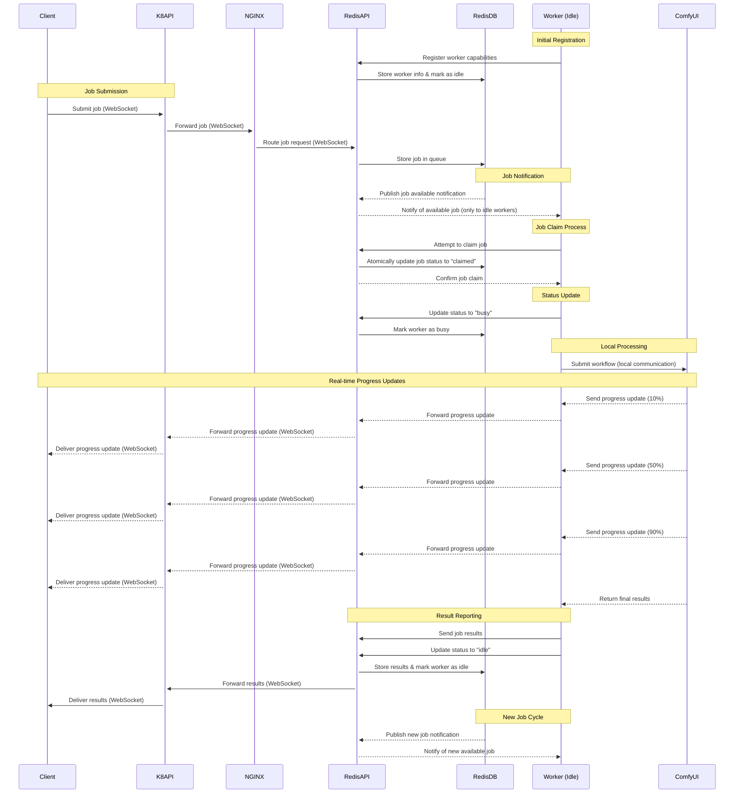

# Redis Queue System Integration Plan

## Overview

This document outlines the comprehensive plan for integrating the Redis queue system into the existing EmProps architecture. It details each component, its deployment location, associated files, and implementation steps to ensure a clear path forward.

## Current Architecture

The existing production system consists of three primary components:

1. **K8/API Server**: Handles client requests and prepares them for ComfyUI processing
2. **NGINX Hub**: Central proxy/load balancer
3. **ComfyUI Servers**: GPU-enabled processing nodes

## Redis Queue Components

### 1. Redis Server

**Purpose**: Central message broker and queue store

**Deployment Location**: 
- Deployed as a separate service from the K8/API
- Must be accessible by both the API and workers

**Configuration Files**:
- Redis configuration (redis.conf)
- Docker compose service definition

**Requirements**:
- Persistence enabled (appendonly)
- Memory optimized for job throughput
- Monitoring enabled

### 2. Queue API Server

**Purpose**: WebSocket API for queue operations and real-time status updates

**Deployment Location**: 
- Deployed separately from the K8/API server
- Runs as a dedicated service handling queue operations

**Core Files**:
- `/docker/redis/core/main.py`: Entry point and server configuration
- `/docker/redis/core/routes.py`: WebSocket route handlers
- `/docker/redis/core/redis_service.py`: Redis interaction logic
- `/docker/redis/core/connections.py`: WebSocket connection management
- `/docker/redis/core/models.py`: Data models and message schemas

**API Endpoints**:
- WebSocket: `/ws` - Primary communication channel
- REST: `/stats` - System statistics (optional)
- REST: `/health` - Health check endpoint

### 3. ComfyUI Worker Adapter

**Purpose**: Connects Redis queue to actual ComfyUI instances for job processing

**Deployment Location**:
- Deployed on each ComfyUI server or nearby with network access
- Acts as a bridge between the queue system and ComfyUI's API

**Core Files**:
- `/docker/redis/adapters/comfyui_worker.py`: Worker registration and job handling
- `/docker/redis/adapters/comfyui_client.py`: Client for communicating with ComfyUI's API endpoints
- `/docker/redis/adapters/job_translator.py`: Translates between queue and ComfyUI workflow formats

**Configuration**:
- Worker ID: Unique identifier for each ComfyUI server
- ComfyUI Connection: URL of the ComfyUI instance (e.g., http://localhost:8188)
- GPU information: Number and types of available GPUs
- Processing capabilities: Supported job types

**Job Processing Flow**:
1. Worker pulls job from Redis queue
2. Job parameters are translated to ComfyUI workflow format
3. Workflow is submitted to ComfyUI API endpoint
4. Worker monitors ComfyUI job progress
5. Results are collected and sent back through Redis
6. Status updates are provided throughout processing

### 4. Monitoring Dashboard

**Purpose**: Provides real-time insight into queue operation and job status

**Deployment Location**:
- Optional component that can be deployed alongside the API server
- Accessible via web browser

**Core Files**:
- `/docker/redis/monitoring/web/index.html`: Main dashboard UI
- `/docker/redis/monitoring/web/js/dashboard.js`: Dashboard functionality
- `/docker/redis/monitoring/server.py`: Optional backend for complex monitoring features

## Integration Strategy

### Phase 1: Infrastructure Setup

1. **Deploy Redis Server**
   - Set up Redis with appropriate configuration
   - Configure persistence and memory settings
   - Deploy as a separate service accessible to all components

2. **Deploy Queue API**
   - Install core package on API server
   - Configure environment variables:
     ```
     REDIS_HOST=<redis-server-host>
     REDIS_PORT=6379
     REDIS_DB=0
     LOG_LEVEL=INFO
     ```
   - Start the Queue API service

3. **Update NGINX Configuration**
   - Add WebSocket routing for the queue API:
     ```
     location /queue/ws {
         proxy_pass http://api-server:8000/ws;
         proxy_http_version 1.1;
         proxy_set_header Upgrade $http_upgrade;
         proxy_set_header Connection "upgrade";
     }
     ```

### Phase 2: Worker Integration

1. **Deploy Worker Adapter**
   - Install adapter package on each ComfyUI server or nearby with network access
   - Configure worker settings:
     ```
     WORKER_ID=<unique-id>
     MACHINE_ID=<machine-name>
     GPU_COUNT=<available-gpus>
     REDIS_HOST=<redis-server-host>
     REDIS_PORT=6379
     COMFYUI_HOST=<comfyui-server-host>
     COMFYUI_PORT=8188
     COMFYUI_WS_PORT=8188
     ```
   - Start the worker adapter service

2. **Test Worker Registration and ComfyUI Connectivity**
   - Verify workers appear in queue system
   - Confirm connections to ComfyUI instances
   - Check heartbeat mechanism
   - Test basic job assignment and processing through ComfyUI
   - Verify results are correctly returned

### Phase 3: API Integration

1. **Update K8/API Server Logic**
   - Add job forwarding to the Redis queue service
   - Maintain existing client-facing API
   - Add status retrieval from the queue system
   - Implement priority job handling

2. **Client Updates**
   - Update WebSocket message formats for queue compatibility
   - Add support for job tracking and priority specification

### Phase 4: Monitoring and Testing

1. **Deploy Monitoring Dashboard**
   - Set up monitoring UI
   - Configure access credentials
   - Test real-time updates

2. **Comprehensive Testing**
   - Test single and multi-worker scenarios
   - Verify job priority handling
   - Confirm proper error recovery
   - Validate worker failover
   - Test high-concurrency scenarios

## Full Deployment Checklist

### Prerequisites
- [ ] Redis server accessible to all components
- [ ] Network connectivity between all nodes
- [ ] Required Python packages installed
- [ ] Firewall rules updated for new connections

### API Server
- [ ] Core package installed
- [ ] Environment variables configured
- [ ] Redis connection verified
- [ ] WebSocket routes tested
- [ ] Error handling verified
- [ ] Job submission tested
- [ ] Status retrieval tested

### NGINX Hub
- [ ] WebSocket proxy configuration added
- [ ] Path routing rules updated
- [ ] Connection upgrade handling verified
- [ ] Load balancing tested (if applicable)

### ComfyUI Workers
- [ ] Worker adapter installed on all GPU nodes
- [ ] Worker registration verified
- [ ] GPU information correctly reported
- [ ] Job processing tested
- [ ] Status updates verified
- [ ] Error handling confirmed

### Monitoring
- [ ] Dashboard accessible
- [ ] Real-time updates working
- [ ] System statistics accurate
- [ ] Job tracking functional
- [ ] Worker status reporting correctly

## Rollback Plan

1. **Quick Rollback Procedure**
   - Revert NGINX configuration to bypass queue
   - Restart API server with queue disabled
   - Stop worker adapters on ComfyUI servers

2. **Data Recovery Process**
   - Extract any pending jobs from Redis
   - Process pending jobs manually if needed
   - Notify users of status changes

## Performance Considerations

- **Redis Memory Usage**: Monitor and tune based on job volume
- **Job Metadata Size**: Limit excessive metadata to prevent memory issues
- **Concurrent Connections**: Adjust based on expected client load
- **Job Cleanup**: Configure appropriate TTL for completed jobs

## Security Considerations

- **Redis Access Control**: Ensure Redis is not exposed publicly
- **WebSocket Authentication**: Implement authentication for queue API access
- **Monitoring Access Control**: Restrict dashboard access to authorized users
- **Data Protection**: Ensure job parameters are handled securely

## Future Enhancements

- **Advanced Scheduling**: Smart allocation based on GPU capabilities
- **Job Dependencies**: Support for workflow jobs with dependencies
- **Extended Metrics**: Advanced performance monitoring
- **Client Libraries**: Language-specific clients for queue integration

## Architectural Flow

```
Client -> K8/API -> Redis/Queue API -> Worker -> ComfyUI API
   ^                     |                 |         |
   |                     |                 |         V
   |                     |                 |    ComfyUI Engine
   |_____________________|_________________|
            Status & Results Flow
```

## Physical Architecture Diagram
<FullscreenDiagram>



</FullscreenDiagram>

## Worker-Job Sequence Diagram

<FullscreenDiagram>



</FullscreenDiagram>

This decoupled architecture maintains a clear separation of concerns:
1. K8/API handles client interactions and request preparation
2. Redis/Queue API manages job queuing, prioritization, and distribution
3. Workers connect to and manage interactions with ComfyUI instances
4. ComfyUI instances perform the actual AI processing work

## Conclusion

This integration plan provides a structured approach to incorporating the Redis queue system as a decoupled component in the existing architecture. By following the outlined phases and checklists, the implementation should proceed smoothly with clear milestones and verification steps.

The Redis queue system will provide enhanced capabilities including job prioritization, improved worker management, and better observability while maintaining compatibility with the existing application flow and without modifying the core functionality of the K8/API system.
