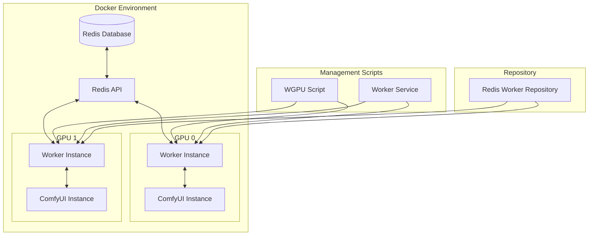

# Redis Worker Management System

## Overview

The Redis Worker Management System provides a scalable and flexible approach to managing worker instances that connect to ComfyUI and the Redis API. This system allows for dynamic allocation of workers to GPUs, enabling efficient utilization of hardware resources and improved fault tolerance.

## Architecture



## Separate Repository Approach

The Redis worker system uses a separate repository approach, similar to how ComfyUI instances are managed. This provides several benefits:

1. **Isolation**: Each worker instance has its own isolated environment
2. **Scalability**: New worker instances can be added dynamically
3. **Maintainability**: Worker code can be updated independently of other components
4. **Fault Tolerance**: Issues with one worker don't affect others

The worker repository is located at `~/code/emprops/redis-worker` and contains the worker implementation that connects to both the Redis API and ComfyUI instances.

## Components

### 1. Worker Implementation (`worker.py`)

The worker implementation connects to both the Redis API and ComfyUI execution service:

- **Redis API Connection**: Establishes a WebSocket connection to the Redis API for job management
- **ComfyUI Connection**: Connects to the ComfyUI instance on the same GPU
- **Job Processing**: Receives jobs from Redis API and forwards them to ComfyUI
- **Status Reporting**: Reports job status back to Redis API

Key environment variables:
- `REDIS_API_HOST`: Hostname of the Redis API service
- `REDIS_API_PORT`: Port of the Redis API service
- `EXECUTION_SERVICE_PORT`: Port of the ComfyUI instance (calculated as 8188 + GPU_ID)
- `MACHINE_ID`: Identifier for the machine running the worker
- `GPU_ID`: GPU identifier for the worker

### 2. Worker Management Script (`wgpu`)

The `wgpu` script, located in the `docker-next/scripts` directory, provides commands for managing worker instances:

```bash
# Usage
wgpu <command> [gpu_id]

# Commands
wgpu start [gpu_id|all]     # Start worker for specified GPU or all GPUs
wgpu stop [gpu_id|all]      # Stop worker for specified GPU or all GPUs
wgpu restart [gpu_id|all]   # Restart worker for specified GPU or all GPUs
wgpu status [gpu_id|all]    # Check status of worker for specified GPU or all GPUs
wgpu logs [gpu_id|all]      # Show logs for specified GPU or all GPUs
wgpu setup [gpu_id|all]     # Setup worker directories for specified GPU or all GPUs
wgpu count                  # Show number of available GPUs
```

### 3. Worker Service Script (`worker`)

The worker service script, also located in the `docker-next/scripts` directory, is responsible for the actual starting, stopping, and monitoring of worker processes:

```bash
# Usage
worker {start|stop|restart|status} <gpu_num>
```

This script is used by the `wgpu` script and shouldn't be called directly in most cases.

## Setup and Configuration

### Docker Compose Configuration

The `docker-compose.yml` file is configured to use the Redis worker repository and the worker management scripts:

```yaml
worker-gpu0:
  <<: *base-service
  container_name: comfy-worker-gpu0
  image: emprops/comfy-worker:latest
  depends_on:
    - redis-api
    - redis-db
    - comfyui-fork-devel
  environment:
    - COMFY_REPO_URL=https://github.com/stakeordie/ComfyUI.git
    - REDIS_API_HOST=redis-api
    - REDIS_API_PORT=8001
    - MACHINE_ID=1
    - GPU_ID=0
    - NUM_GPUS=2
  volumes:
    - ~/code/emprops/redis-worker:/workspace/redis-worker
    - ./scripts:/workspace/scripts
  command: ["/bin/bash", "-c", "chmod +x /workspace/scripts/wgpu /workspace/scripts/worker && /workspace/scripts/wgpu setup 0 && /workspace/scripts/wgpu start 0 && tail -f /dev/null"]
  deploy:
    resources:
      reservations:
        devices:
          - driver: nvidia
            count: 1
            capabilities: [gpu]
  networks:
    - emprops-network
```

### Initial Setup

1. Create the Redis worker repository:
   ```bash
   mkdir -p ~/code/emprops/redis-worker
   ```

2. Copy the worker implementation:
   ```bash
   cp /path/to/worker.py ~/code/emprops/redis-worker/
   ```

3. Start the Docker environment:
   ```bash
   cd /path/to/docker-next
   docker-compose up -d
   ```

## Usage Examples

### Starting Workers

```bash
# Start worker for GPU 0
docker exec -it comfy-worker-gpu0 /workspace/scripts/wgpu start 0

# Start workers for all GPUs
docker exec -it comfy-worker-gpu0 /workspace/scripts/wgpu start all
```

### Checking Worker Status

```bash
# Check status of worker for GPU 0
docker exec -it comfy-worker-gpu0 /workspace/scripts/wgpu status 0

# Check status of all workers
docker exec -it comfy-worker-gpu0 /workspace/scripts/wgpu status all
```

### Viewing Worker Logs

```bash
# View logs for worker on GPU 0
docker exec -it comfy-worker-gpu0 /workspace/scripts/wgpu logs 0

# View logs for all workers
docker exec -it comfy-worker-gpu0 /workspace/scripts/wgpu logs all
```

### Restarting Workers

```bash
# Restart worker for GPU 1
docker exec -it comfy-worker-gpu1 /workspace/scripts/wgpu restart 1

# Restart all workers
docker exec -it comfy-worker-gpu0 /workspace/scripts/wgpu restart all
```

## Worker Directory Structure

Each worker instance has its own directory structure:

```
/workspace/
├── redis-worker/         # Shared worker repository
│   └── worker.py         # Worker implementation
├── worker_gpu0/          # Worker instance for GPU 0
│   ├── worker.py         # Copy of worker.py
│   ├── worker.pid        # PID file for the worker process
│   └── logs/             # Log directory
│       └── output.log    # Worker logs
├── worker_gpu1/          # Worker instance for GPU 1
│   ├── worker.py         # Copy of worker.py
│   ├── worker.pid        # PID file for the worker process
│   └── logs/             # Log directory
│       └── output.log    # Worker logs
```

## Troubleshooting

### Worker Fails to Start

If a worker fails to start, check the following:

1. Verify the Redis API is running:
   ```bash
   docker ps | grep redis-api
   ```

2. Check the worker logs:
   ```bash
   docker exec -it comfy-worker-gpu0 /workspace/scripts/wgpu logs 0
   ```

3. Verify the ComfyUI instance is running:
   ```bash
   docker exec -it comfy-worker-gpu0 curl -s http://localhost:8188
   ```

### Worker Loses Connection

If a worker loses connection to the Redis API or ComfyUI:

1. Check the worker status:
   ```bash
   docker exec -it comfy-worker-gpu0 /workspace/scripts/wgpu status 0
   ```

2. Restart the worker:
   ```bash
   docker exec -it comfy-worker-gpu0 /workspace/scripts/wgpu restart 0
   ```

3. Check the Redis API logs:
   ```bash
   docker logs redis-api
   ```

## Advanced Configuration

### Custom Worker Settings

You can customize worker behavior by modifying environment variables in the `docker-compose.yml` file:

```yaml
environment:
  - REDIS_API_HOST=redis-api
  - REDIS_API_PORT=8001
  - MACHINE_ID=custom-machine-id
  - GPU_ID=0
  - NUM_GPUS=2
  # Add custom settings here
```

### Multiple Machines

To run workers across multiple machines:

1. Set up the Redis API to be accessible from all machines
2. Configure each machine with a unique `MACHINE_ID`
3. Set up the worker repository on each machine
4. Configure the Docker environment on each machine

## Conclusion

The Redis Worker Management System provides a flexible and scalable approach to managing worker instances that connect to ComfyUI and the Redis API. By using a separate repository approach and dedicated management scripts, it enables efficient utilization of hardware resources and improved fault tolerance.
